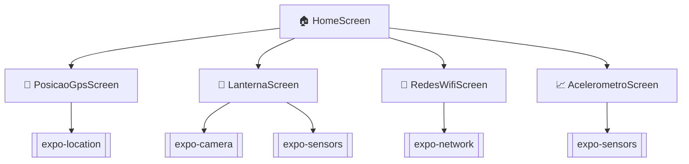
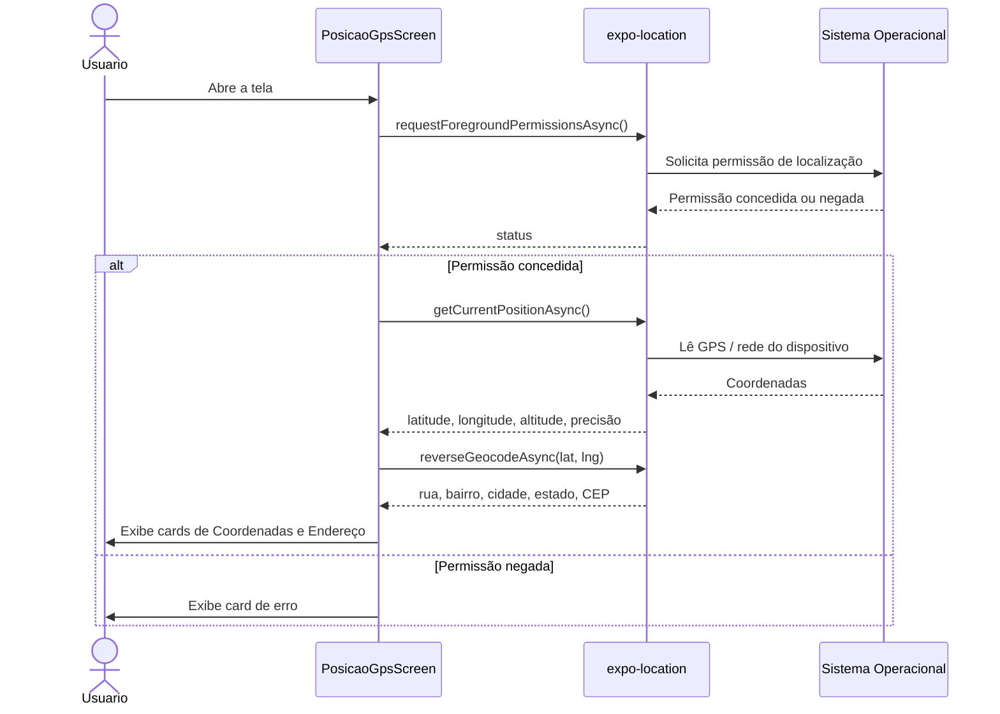
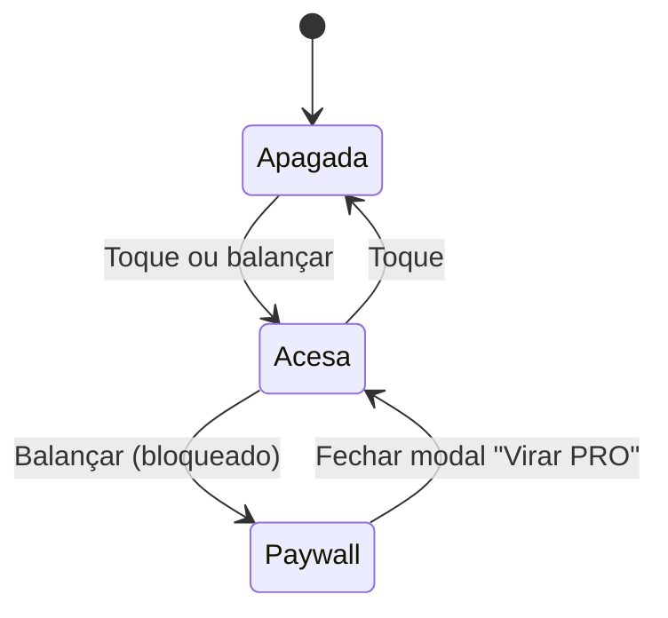

# 📡 Sensores — App de Sensores com Expo

Aplicativo mobile educacional que explora os sensores e APIs nativas do dispositivo — GPS, câmera/lanterna, acelerômetro e rede — construído com **Expo SDK 54** e **React Native**.

<p>
  
  
  
  
  
</p>

<p>
  
  
  
</p>

## Índice

- [Sobre o projeto](#sobre-o-projeto)
- [Documentação de arquitetura](#documentação-de-arquitetura)
- [Funcionalidades](#funcionalidades)
- [Arquitetura de navegação](#arquitetura-de-navegação)
- [Fluxo — Posição GPS](#fluxo--posição-gps)
- [Fluxo — Lanterna](#fluxo--lanterna)
- [Estrutura de pastas](#estrutura-de-pastas)
- [Stack tecnológica](#stack-tecnológica)
- [Permissões nativas](#permissões-nativas)
- [Pré-requisitos](#pré-requisitos)
- [Como rodar](#como-rodar)
- [Scripts disponíveis](#scripts-disponíveis)
- [Limitações conhecidas](#limitações-conhecidas)

## Sobre o projeto

Este é o **Roteiro 1 (Sensores)** da disciplina de Desenvolvimento Mobile — um app único com quatro telas, cada uma explorando uma API nativa diferente através do Expo, com uma tela inicial de navegação (`HomeScreen`) que dá acesso a todas elas.

## Documentação de arquitetura

Este README cobre a visão geral e o "como rodar". Para detalhes de arquitetura — camadas do app, padrões de estado repetidos entre telas, navegação tipada e permissões por plataforma — veja **[`docs/`](./docs/README.md)**.

## Funcionalidades

| Tela | API / Sensor | Descrição |
|---|---|---|
| 📍 **Posição GPS** | `expo-location` | Lê latitude, longitude, altitude e precisão do GPS e converte as coordenadas em endereço (rua, número aproximado, bairro, CEP, cidade e estado) via geocodificação reversa. |
| 🔦 **Lanterna** | `expo-camera` + `expo-sensors` | Liga/desliga a lanterna do dispositivo por toque ou balançando o aparelho (detectado pelo acelerômetro). Apagar balançando é bloqueado atrás de um modal de "upgrade PRO" (easter egg). |
| 📶 **Redes Wi-Fi** | `expo-network` | Mostra o estado da conexão atual: tipo de rede, IP, alcance de internet e modo avião (Android), com atualização automática por listener. |
| 📈 **Acelerômetro** | `expo-sensors` | Exibe em tempo real os eixos X, Y, Z (em força g) e a magnitude vetorial, com controles para iniciar, pausar e zerar a leitura. |

## Arquitetura de navegação

Todas as telas são registradas em uma `Stack Navigator` única (`@react-navigation/native-stack`), partindo da `HomeScreen`:



## Fluxo — Posição GPS

Sequência de permissão → leitura de GPS → geocodificação reversa, exibida em dois cards (Coordenadas e Endereço):



## Fluxo — Lanterna

Estado da lanterna e o bloqueio (de brincadeira) ao tentar apagar balançando o aparelho:



## Estrutura de pastas

```text
s1-r1-sensores-1/
├── App.tsx                     # Stack Navigator raiz — registra as 5 telas
├── index.ts                    # Entry point do Expo
├── app.json                    # Configuração do app (ícones, plugins, permissões)
├── src/
│   ├── screens/
│   │   ├── Home/                # Menu inicial com os cards de navegação
│   │   ├── PosicaoGPS/          # GPS + geocodificação reversa
│   │   ├── Lanterna/            # Torch + gesto de balançar (acelerômetro)
│   │   ├── RedesWifi/           # Estado de rede / conexão
│   │   └── acelerometro/        # Leitura em tempo real do acelerômetro
│   └── types/
│       └── navigation.ts        # Tipagem das rotas (RootStackParamList)
└── assets/                      # Ícones e splash screen
```

## Stack tecnológica

| Categoria | Pacote | Versão |
|---|---|---|
| Framework | `expo` | `~54.0.35` |
| Runtime | `react` / `react-native` | `19.1.0` / `0.81.5` |
| Navegação | `@react-navigation/native` + `native-stack` | `^7.x` |
| Linguagem | `typescript` | `~5.9.2` |
| Localização | `expo-location` | `~19.0.8` |
| Câmera / Lanterna | `expo-camera` | `~17.0.10` |
| Sensores de movimento | `expo-sensors` | `~15.0.8` |
| Rede | `expo-network` | `~8.0.8` |
| Info do dispositivo | `expo-device` | `8.0.10` |
| Área segura | `react-native-safe-area-context` | `~5.6.0` |

## Permissões nativas

| Permissão | Origem | Usada em |
|---|---|---|
| Localização em primeiro plano | `expo-location` (`requestForegroundPermissionsAsync`) | Posição GPS |
| Câmera | Plugin `expo-camera` (declarado em `app.json`) | Lanterna |
| Movimento / Acelerômetro | `expo-sensors` (sem prompt explícito na maioria das plataformas) | Lanterna, Acelerômetro |

> A permissão de câmera é solicitada apenas para controlar a tocha (torch) do dispositivo — nenhum vídeo é gravado ou exibido.

## Pré-requisitos

- [Node.js](https://nodejs.org/) 18 ou superior
- npm (ou yarn/pnpm, adaptando os comandos)
- App **Expo Go** instalado no celular ([Android](https://play.google.com/store/apps/details?id=host.exp.exponent) / [iOS](https://apps.apple.com/app/expo-go/id982107779)), ou um emulador Android / simulador iOS configurado

## Como rodar

```bash
# 1. Clonar o repositório
git clone https://github.com/rafafrd/s1_r1_sensors-mobile-m4h.git
cd s1-r1-sensores-1

# 2. Instalar as dependências
npm install

# 3. Iniciar o servidor de desenvolvimento
npm run start
```

Depois de iniciado, escaneie o QR code com o app **Expo Go** (Android) ou a câmera do iPhone (iOS), ou pressione `a` / `i` no terminal para abrir direto em um emulador/simulador.

## Scripts disponíveis

| Comando | Descrição |
|---|---|
| `npm run start` | Inicia o Metro Bundler / Expo Dev Server |
| `npm run android` | Abre o app em um emulador ou dispositivo Android |
| `npm run ios` | Abre o app em um simulador ou dispositivo iOS |
| `npm run web` | Abre o app no navegador (suporte parcial, algumas APIs nativas não funcionam na web) |

## Limitações conhecidas

- **Varredura de redes Wi-Fi:** listar redes próximas e ler o SSID exige um módulo nativo fora do Expo Go (development build); por isso a tela de Redes Wi-Fi mostra apenas os dados da conexão ativa.
- **Modo avião:** a detecção (`isAirplaneModeEnabledAsync`) só está disponível no Android.
- **Geocodificação reversa:** depende de serviços de geocoding do sistema — em emuladores Android sem Google Play Services o `reverseGeocodeAsync` pode falhar.
- **Web:** câmera/lanterna, acelerômetro e alguns dados de rede têm suporte limitado ou nulo fora de Android/iOS.
