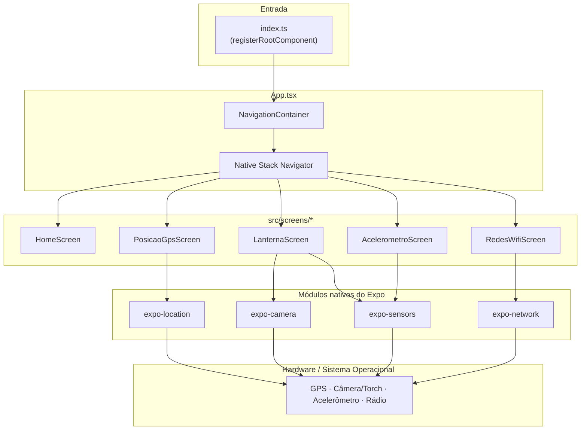

# Visão Geral da Arquitetura

## Resumo

O app **Sensores** é um projeto **Expo (SDK 54) + React Native + TypeScript** de tela única de menu (`HomeScreen`) que navega para quatro telas independentes, cada uma "dona" de um sensor/API nativa. Não há backend, autenticação ou persistência — todo o estado vive na memória de cada tela, lido diretamente de módulos nativos do Expo.

## Camadas

Não existe uma camada de "serviços" ou "repositórios" separando UI de dados: cada componente de tela chama as APIs do Expo diretamente dentro de `useEffect`/handlers e guarda o resultado em `useState` local. Para o tamanho atual do app (4 telas, sem dados compartilhados entre elas) isso é uma escolha razoável — ver [`04-padroes-de-estado.md`](./04-padroes-de-estado.md) para os padrões que se repetem entre as telas e onde uma camada de hooks compartilhados compensaria.

## Decisões de arquitetura

| Decisão | Por quê |
|---|---|
| **Sem gerenciador de estado global** (Redux/Zustand/Context) | Nenhuma tela depende de dado de outra — cada uma lê seu sensor de forma isolada. `useState`/`useEffect` local é suficiente. |
| **Sem camada de serviços** | Chamadas ao SDK do Expo (`Location.*`, `Accelerometer.*`, `Network.*`) são feitas direto no componente. Simples de rastrear, com o custo de alguma duplicação de padrão entre telas (detalhado em `04-padroes-de-estado.md`). |
| **Navegação por Stack único** | Não há fluxos aninhados (tabs, drawers) — uma pilha simples (`createNativeStackNavigator`) resolve a navegação Home → tela do sensor → voltar. |
| **Estilos por tela via `StyleSheet.create`** | Cada `index.tsx` define seus próprios estilos ao final do arquivo, comentados. Não há um arquivo de tema central, mas as telas convergem informalmente para a mesma paleta (ver abaixo). |
| **TypeScript estrito nas rotas** | `RootStackParamList` tipa cada rota e seus parâmetros, então `navigation.navigate(...)` é checado em tempo de compilação (ver [`02-navegacao.md`](./02-navegacao.md)). |

## Convenções visuais (design tokens informais)

Não existe um arquivo de tema compartilhado, mas todas as telas repetem a mesma paleta de cores nos seus `StyleSheet.create`. Documentar isso aqui serve tanto de referência quanto de sinal: são candidatos naturais para um futuro `src/theme.ts`.

| Token | Valor | Uso |
|---|---|---|
| Fundo de tela | `#F6F7F8` | `SafeAreaView`/`View` raiz de toda tela |
| Fundo de card | `#FFFFFF` | Cards de conteúdo (`card`, `axisCard`, `magnitudeCard`) |
| Borda de card | `#E4E8E5` | Borda de 1px em todos os cards |
| Texto primário | `#18211B` | Títulos, valores em destaque |
| Texto secundário | `#66706A` | Subtítulos, rótulos, texto de apoio |
| Verde de destaque | `#25883E` | Botões primários, status positivo, valores de sucesso |
| Divisor | `#EEF1EF` | Linha fina entre seções dentro de um card |
| Erro — fundo / borda / texto | `#FCF2F2` / `#F0C9C9` / `#B12727` | Cards e mensagens de erro em todas as telas |
| Nota informativa — fundo / borda | `#F1F6F2` / `#D6E6D9` | Cards de aviso não-crítico (ex.: limitações do Expo Go em Redes Wi-Fi) |

Cores específicas de uma única tela (ex.: `#FFF6D8`/`#F2C94C` da Lanterna acesa, ou `#B12727`/`#25883E`/`#376FA3` dos eixos X/Y/Z do Acelerômetro) ficam documentadas em [`03-telas.md`](./03-telas.md).

## Stack tecnológica

| Camada | Tecnologia |
|---|---|
| Framework | Expo SDK 54 (`~54.0.35`) |
| UI | React 19 + React Native 0.81 |
| Linguagem | TypeScript 5.9 |
| Navegação | React Navigation 7 (`native-stack`) |
| Sensores/APIs nativas | `expo-location`, `expo-camera`, `expo-sensors`, `expo-network`, `expo-device` |
| Área segura | `react-native-safe-area-context` |

Veja o [`README.md`](../README.md) para a tabela completa de versões e o passo a passo de instalação.
