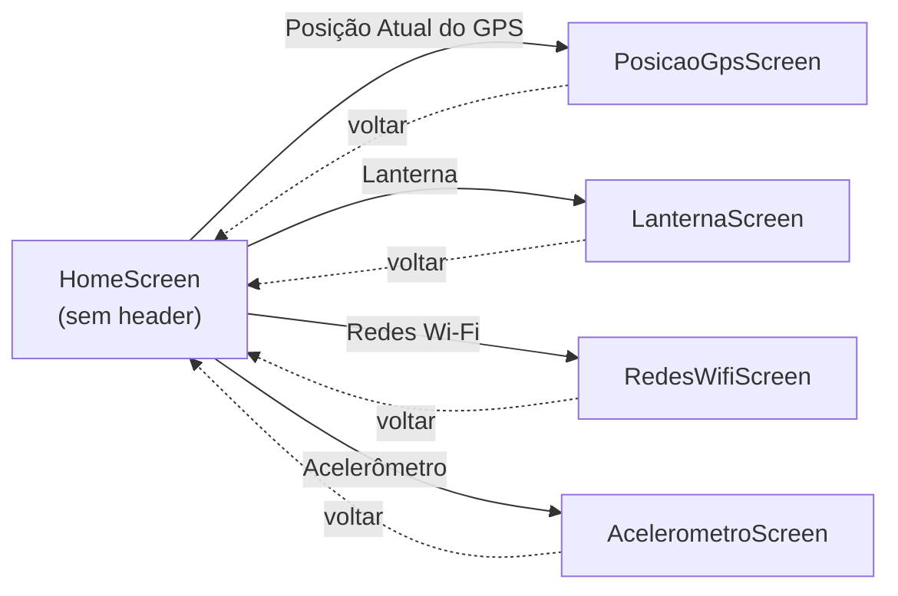

# Navegação

## Estrutura

O app usa um único **Native Stack Navigator** (`@react-navigation/native-stack`), registrado em `App.tsx`. Não há tabs, drawers nem stacks aninhadas — toda navegação é Home → tela do sensor, com o botão de voltar nativo da stack.



## Tipagem das rotas

`src/types/navigation.ts` define o `RootStackParamList`, usado tanto pelo `Stack.Navigator` quanto pelo hook `useNavigation` na Home:

```ts
export type RootStackParamList = {
  HomeScreen: undefined;
  PosicaoGpsScreen: undefined;
  LanternaScreen: undefined;
  RedesWifiScreen: undefined;
  AcelerometroScreen: undefined;
}
```

Todas as rotas são `undefined` — nenhuma tela recebe parâmetros via navegação hoje. Em `HomeScreen`, isso é usado para tipar a navegação:

```ts
type NavigationProp = NativeStackNavigationProp<RootStackParamList, 'HomeScreen'>;
const navigation = useNavigation<NavigationProp>();
navigation.navigate(item.route); // item.route: keyof RootStackParamList
```

Isso garante que `navigate('RotaQueNaoExiste')` quebre a build antes de virar bug em runtime.

## Registro das rotas e headers

Em `App.tsx`, cada tela recebe seu `title` de header nativo — exceto a Home, que esconde o header padrão para desenhar seu próprio cabeçalho:

| Rota | Componente | `title` do header | `headerShown` |
|---|---|---|---|
| `HomeScreen` | `src/screens/Home` | — | `false` (cabeçalho customizado dentro da própria tela) |
| `PosicaoGpsScreen` | `src/screens/PosicaoGPS` | "Posição Atual do GPS" | `true` (padrão) |
| `LanternaScreen` | `src/screens/Lanterna` | "Lanterna" | `true` (padrão) |
| `RedesWifiScreen` | `src/screens/RedesWifi` | "Informações de Rede" | `true` (padrão) |
| `AcelerometroScreen` | `src/screens/acelerometro` | "Acelerômetro" | `true` (padrão) |

## Menu da Home

`HomeScreen` não hardcoda o JSX de cada item — ele itera sobre um array `menuItems` (`title`, `description`, `route`) e renderiza um card tocável por item, chamando `navigation.navigate(item.route)`. Adicionar uma nova tela ao menu é só adicionar uma entrada nesse array (mais, claro, registrar a rota em `RootStackParamList` e em `App.tsx`).
