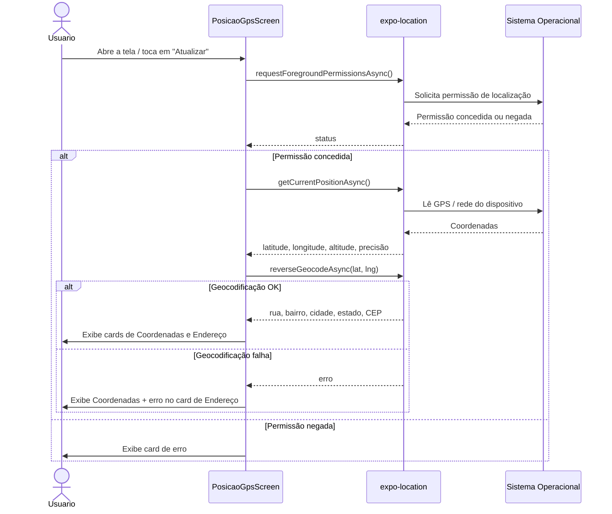
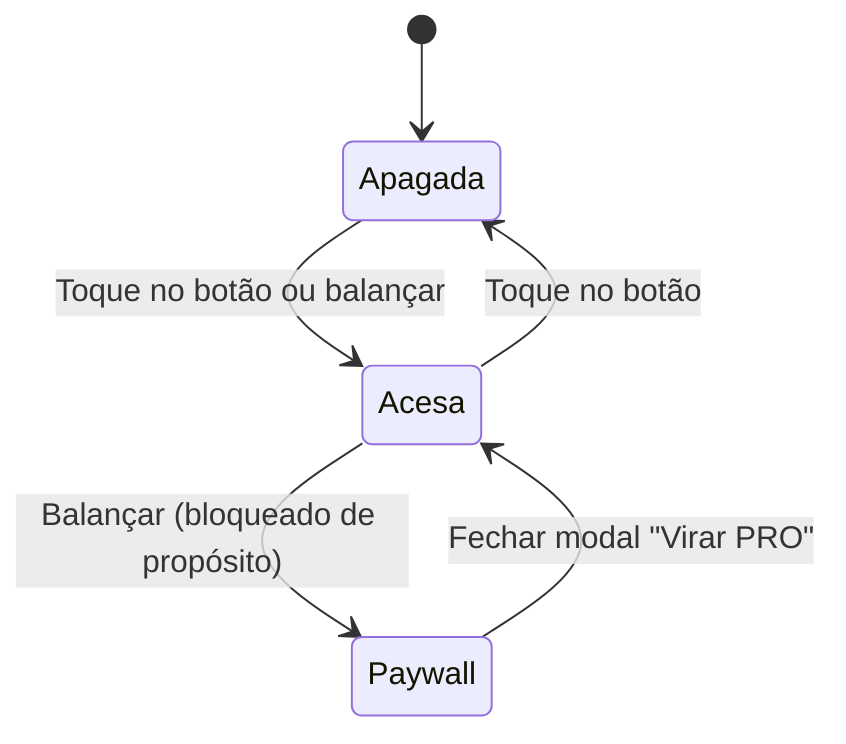
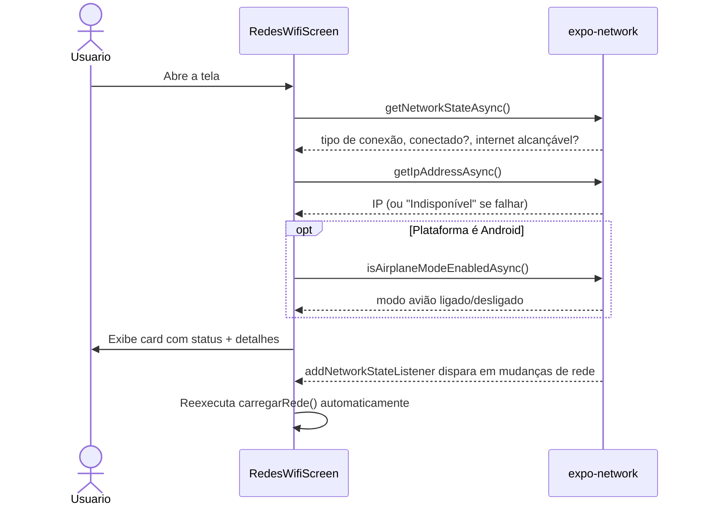
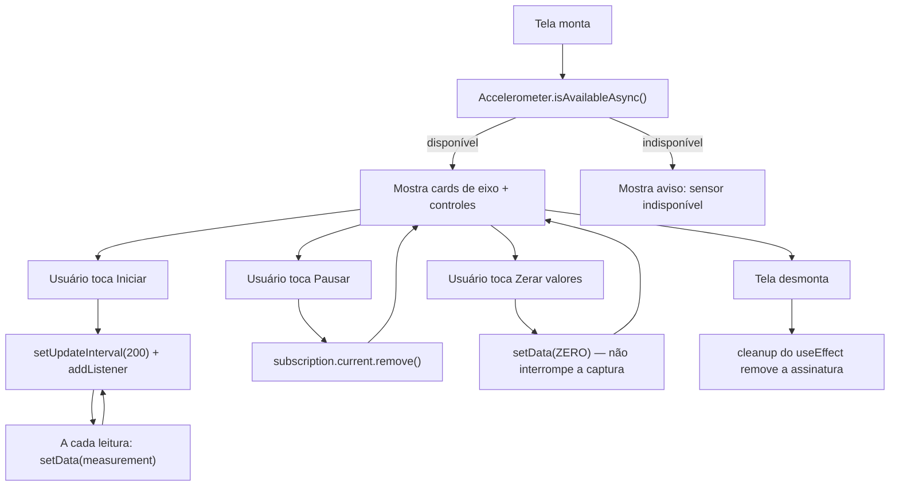

# Telas

Cada tela em `src/screens/*` é autocontida: possui seu próprio estado, efeitos e `StyleSheet`. Esta página documenta a responsabilidade e o comportamento interno de cada uma.

## `PosicaoGPS` — GPS + Geocodificação

**Arquivo:** `src/screens/PosicaoGPS/index.tsx`

| Estado | Tipo | Descrição |
|---|---|---|
| `location` | `Location.LocationObject \| null` | Última leitura de coordenadas do GPS |
| `errorMsg` | `string \| null` | Erro ao obter permissão/posição (ex.: permissão negada) |
| `address` | `Location.LocationGeocodedAddress \| null` | Objeto completo devolvido pela geocodificação reversa |
| `addressError` | `string \| null` | Erro isolado da etapa de geocodificação (não invalida as coordenadas já obtidas) |
| `loading` | `boolean` | Controla o spinner inicial e desabilita o botão "Atualizar" |

A tela expõe dois cards independentes — **Coordenadas** (latitude, longitude, altitude, precisão, horário da leitura) e **Endereço** (rua, número aproximado, bairro, CEP, cidade, estado) — porque a etapa de geocodificação pode falhar mesmo com o GPS funcionando (ex.: emulador Android sem Google Play Services), e cada card reporta seu próprio erro.

## `Lanterna` — Torch + gesto de balançar

**Arquivo:** `src/screens/Lanterna/index.tsx`

| Estado/Ref | Tipo | Descrição |
|---|---|---|
| `permission` | `CameraPermissionResponse` | Vem de `useCameraPermissions()`, controla se a `CameraView` pode ser montada |
| `ligada` | `boolean` | Se a tocha está acesa |
| `modalPagamentoVisivel` | `boolean` | Controla o modal de "upgrade PRO" (easter egg) |
| `ligadaRef` | `useRef<boolean>` | Espelha `ligada` para ser lido dentro do listener do acelerômetro sem recriar a assinatura a cada toggle |
| `ultimaLeitura` / `ultimoBalancoEm` | `useRef` | Guardam a última leitura de aceleração e o timestamp do último "balanço" detectado, para debounce |

A tela usa uma `CameraView` **invisível** (1×1px, opacidade 0) apenas para poder chamar `enableTorch` — o `expo-camera` exige uma câmera montada para controlar a lanterna, mesmo sem exibir o preview.

O gesto de "balançar" é detectado via `Accelerometer.addListener`: a variação absoluta de `x` e `y` entre leituras consecutivas é somada; se ultrapassar `LIMIAR_BALANCO` (1.7) e o último balanço detectado foi há mais de `INTERVALO_ENTRE_BALANCOS_MS` (1200ms), conta como um novo balanço.

> Apagar balançando é **bloqueado de propósito** atrás do modal "Vire PRO 💎" — é uma piada/easter egg do projeto, não uma limitação técnica real.

## `RedesWifi` — Estado de rede

**Arquivo:** `src/screens/RedesWifi/index.tsx`

| Estado | Tipo | Descrição |
|---|---|---|
| `info` | `NetworkInfo \| null` | Tipo de conexão, IP, alcance de internet e modo avião |
| `errorMsg` | `string \| null` | Erro ao consultar `expo-network` |
| `loading` | `boolean` | Controla o spinner inicial |

`carregarRede` (memoizada com `useCallback`) busca `getNetworkStateAsync()`, `getIpAddressAsync()` e, **somente no Android**, `isAirplaneModeEnabledAsync()` — cada chamada tem seu próprio `try/catch` interno, então a falha de uma (ex.: IP indisponível) não derruba as outras.

A tela também assina `Network.addNetworkStateListener`, então a UI se atualiza sozinha se o usuário trocar de Wi-Fi para dados móveis, por exemplo — sem precisar tocar em "Atualizar".

## `acelerometro` — Leitura em tempo real

**Arquivo:** `src/screens/acelerometro/index.tsx`

| Estado/Ref | Tipo | Descrição |
|---|---|---|
| `data` | `AccelerometerMeasurement` | Última leitura `{x, y, z, timestamp}`, inicia zerada |
| `isRunning` | `boolean` | Se a captura está ativa |
| `isAvailable` | `boolean \| null` | `null` enquanto verifica, depois `true`/`false` conforme o sensor existe no dispositivo |
| `subscription` | `useRef<Subscription \| null>` | Guarda a assinatura do listener para poder removê-la ao pausar/desmontar, sem causar re-render |

A magnitude vetorial (`Math.hypot(x, y, z)`) combina os três eixos num único valor — próximo de 1g em repouso (gravidade), próximo de 0g em queda livre.

## `Home` — Menu inicial

**Arquivo:** `src/screens/Home/index.tsx`

Sem estado próprio além do que o React Navigation gerencia. Renderiza a lista `menuItems` (ver [`02-navegacao.md`](./02-navegacao.md)) como cards tocáveis, cada um navegando para a rota correspondente.
