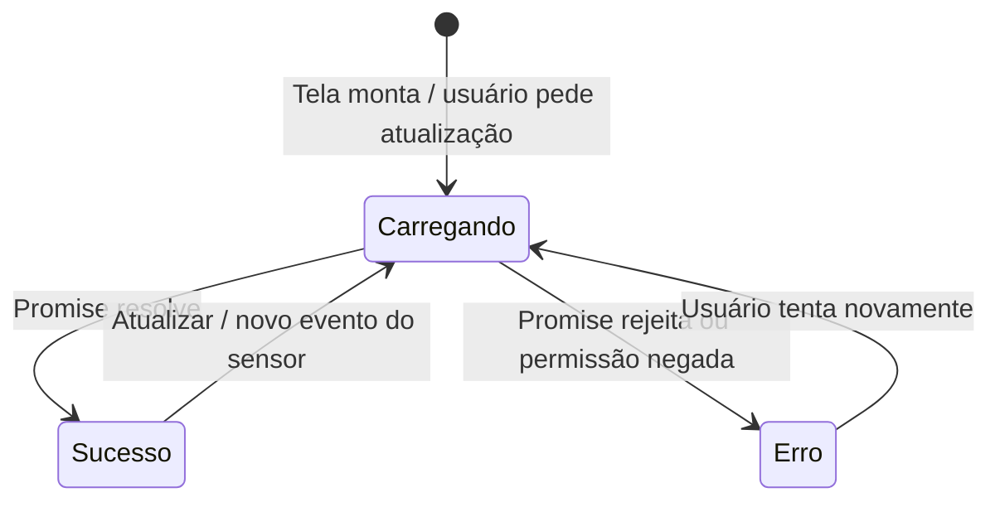

# Padrões de Estado

Nenhuma tela compartilha código de estado com outra hoje — mas todas convergem, de forma independente, para os mesmos dois padrões. Documentar isso ajuda a manter consistência ao criar novas telas e sinaliza onde uma extração para hooks compartilhados (`src/hooks/`) compensaria se o app crescer.

## Padrão 1 — Carregamento / Erro / Sucesso

`PosicaoGpsScreen`, `RedesWifiScreen` e `AcelerometroScreen` seguem o mesmo formato ao buscar dado assíncrono de um sensor:



Implementação típica (`PosicaoGpsScreen.getCurrentLocation`, `RedesWifiScreen.carregarRede`):

```ts
const carregar = useCallback(async () => {
  setLoading(true);
  setErrorMsg(null);
  try {
    const resultado = await ModuloExpo.buscarAlgo();
    setDado(resultado);
  } catch (error) {
    console.error(error);
    setErrorMsg("Mensagem amigável de erro");
  } finally {
    setLoading(false);
  }
}, []);

useEffect(() => { carregar(); }, [carregar]);
```

Cada tela repete essa forma com nomes diferentes (`getCurrentLocation`/`carregarRede`) em vez de compartilhar uma implementação. Funciona bem no tamanho atual do projeto; se um quinto/sexto sensor for adicionado seguindo o mesmo formato, vale extrair para algo como `useAsyncResource(fn)`.

## Padrão 2 — Assinatura de sensor contínuo (`addListener`/`remove`)

`LanternaScreen` (para detectar o gesto de balançar) e `AcelerometroScreen` (para exibir leitura em tempo real) assinam o **mesmo** `Accelerometer.addListener` do `expo-sensors`, cada uma com sua própria cópia da lógica de assinatura/cancelamento:

```ts
useEffect(() => {
  Accelerometer.setUpdateInterval(intervaloMs);
  const subscription = Accelerometer.addListener((measurement) => {
    // ... lógica específica da tela
  });
  return () => subscription.remove(); // limpeza obrigatória ao desmontar
}, []);
```

Diferenças entre as duas telas:

| | `LanternaScreen` | `AcelerometroScreen` |
|---|---|---|
| Intervalo de leitura | 100ms | 200ms |
| O que faz com a leitura | Calcula delta de movimento para detectar "balanço" | Guarda a leitura bruta em `state.data` para exibir |
| Controle de início/parada | Sempre ativo enquanto a tela existe | Usuário controla via botões Iniciar/Pausar (`subscription` fica em `useRef` para poder remover e recriar sob demanda) |

Como a lógica de "assinar, capturar leitura, desinscrever no cleanup" é idêntica, um hook como `useAccelerometer(intervaloMs)` retornando `{ data, isAvailable }` eliminaria a duplicação — hoje não existe porque cada tela foi escrita isoladamente durante o roteiro, mas é o refactor mais natural se uma terceira tela precisar do acelerômetro.

## Por que não usar um estado global aqui

Nenhum dos dois padrões acima precisa ser compartilhado *entre telas* — cada tela lê seu próprio sensor de forma independente e nenhuma outra tela consome esse dado. A duplicação identificada é **entre implementações do mesmo padrão**, não de **dado compartilhado**. Por isso a recomendação é extrair *hooks* reutilizáveis (lógica), não um *store* global (dado) — ver [`01-visao-geral.md`](./01-visao-geral.md#decisões-de-arquitetura) para o raciocínio completo.
